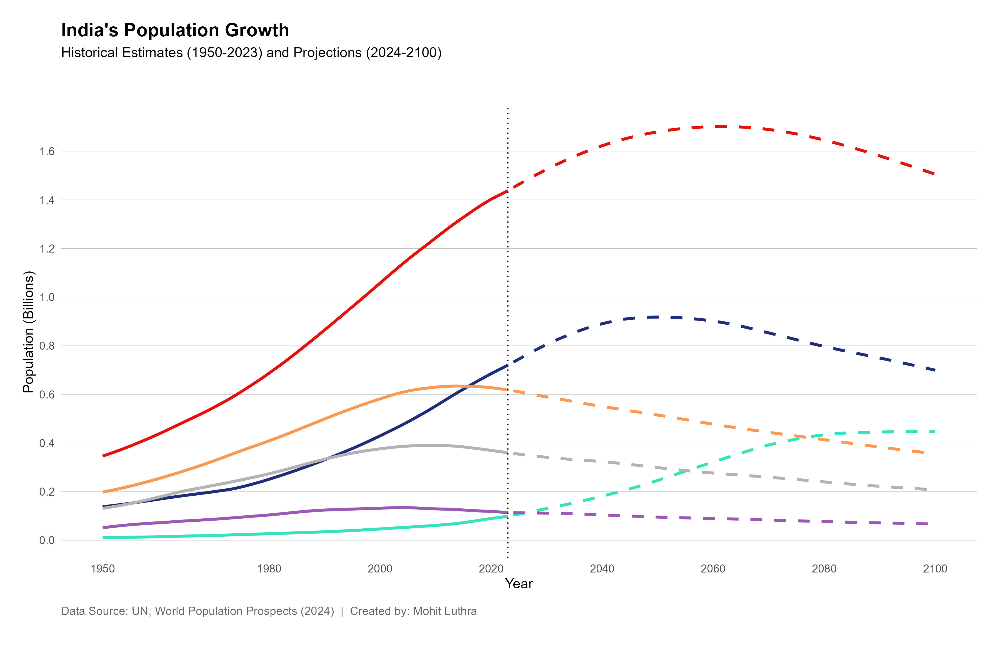

# India Population Growth Analysis 📊

A comprehensive demographic analysis of India's population trends from 1950-2100, combining historical data with UN projections.

## 🎯 Key Insights

- **Population Peak**: India's population is projected to peak at ~1.7 billion around 2065
- **Demographic Dividend**: Working-age population (25-64) will peak by 2040, creating a 15-year window of opportunity
- **Aging Society**: Population aged 65+ will triple by 2050, requiring significant policy adjustments
- **Youth Decline**: The 0-24 age group shows declining trends post-2020, indicating demographic transition

## 📊 Visualization Features

The analysis produces a publication-ready visualization showing:
- Historical population estimates (1950-2023) with solid lines
- Medium-variant UN projections (2024-2100) with dashed lines
- Color-coded age groups for easy interpretation

## 🛠️ Technical Stack

- **Language**: R (v4.x)
- **Libraries**: ggplot2, reshape2
- **Data Source**: UN World Population Prospects (2024 Revision)

## 💡 Key Findings

India is experiencing a classic demographic transition with declining fertility rates. The working-age population bulge presents a one-time demographic dividend opportunity through 2040, after which rapid aging will require healthcare and pension reforms.

## 👤 Author

**Mohit Luthra**
- Data Scientist specializing in Digital Marketing Analytics & Data Visualization

---
*Created with R and ggplot2*
